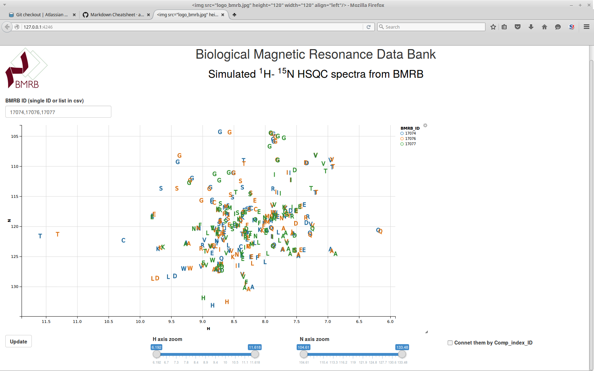
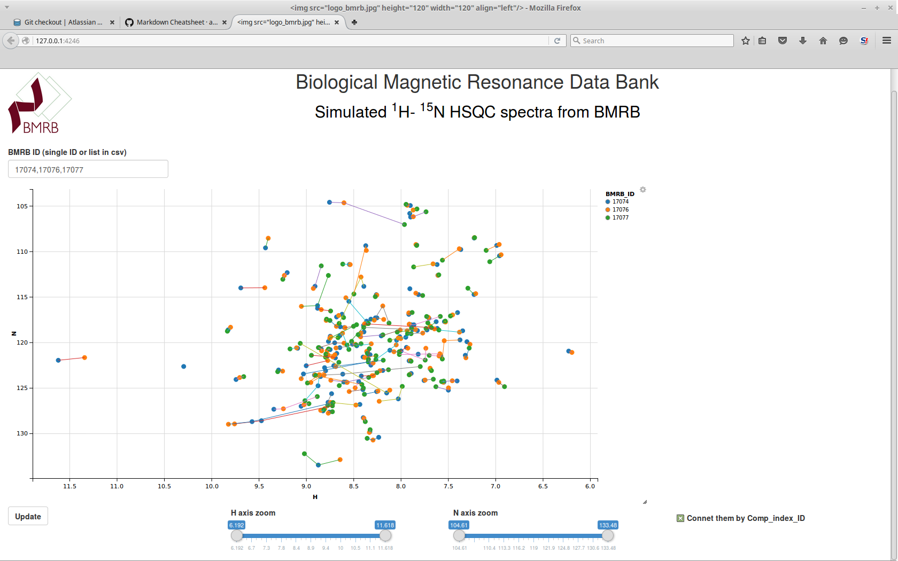
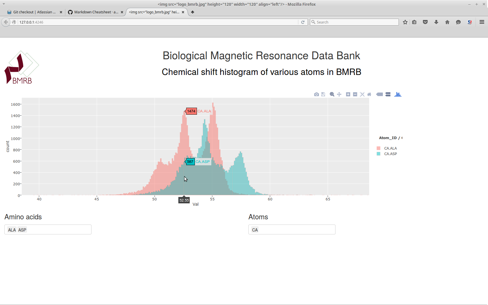

#RBMRB

RBMRB is an API written in R  to import chemical shift data directly from [BMRB](http://bmrb.wisc.edu/) into R environment 
as a data frame in R. This facilitates access to BMRB data for statistical analysis and data visualization. 

##Installation

### Requirements

RBMRB requires the package **httr** to import data from BMRB and **reshape2** to format the data into a data frame in R. If you already have these packages installed, then you may proceed with the installation of RBMRB package, otherwise please install these packages first and then proceed further.

Here is the instruction to install those packages. Open your R and use the following command 

```{r eval=F}
install.packages(c("httr","reshape2"))
```
you may also install packages by navigating through menu in RStudio or R.

Once you have installed the necessary packages, then you can download and install RBMRB.
Source package can be downloaded from this [link](https://github.com/uwbmrb/RBMRB/blob/master/RBMRB_0.1.tar.gz?raw=true)

After downloading use the following command to install RBMRB
```{r}
install.packages("~/Downloads/RBMRB_0.1.tar.gz",repos=NULL,type="source")
```

Note: provide the correct path to the downloaded file.

##Usage
RBMRB can be used in a similar way like any other library in R. 

```{r}
library(RBMRB)
```

To fetch chemical shift table of a specific entry
```{r}
df<-fetchBMRB('15060')
```
Imported data frame contains following columns
```{r}
colnames(df)
```

Its also possible to load multiple entries as a single data frame
```{r}
df<-fetchBMRB('17074,17076,17077')
```

These data frames can be reformatted using the function **N15HSQC** to simulate HSQC spectrum from the data frame.
```{r}
hsqc<-N15HSQC(df)
```
Now user can use his own plotting function to visualize HSQC spectrum
for example
```{r}
library(ggplot2)
ggplot(hsqc)+
  geom_point(aes(H,N,color=as.character(BMRB_ID)))+
  scale_x_reverse()+scale_y_reverse()
```

The entire chemical shift table can be imported using the following command. 
```{r}
df_all<-fetchallBMRB()
```
Note: This will take some time, depends on the internet connection speed  to download ~500MB csv file from the FTP
server.
Once it is downloaded, then you have full chemical shift information of all entries. 
```{r}
colnames(df_all)
```

Hint: If you are going to use  ***fetchallBMRB*** very often, then it is a good idea to download the all atom chemical shift csv file from [this](http://www.bmrb.wisc.edu/ftp/pub/bmrb/relational_tables/nmr-star3.1/Atom_chem_shift.csv) ftp server and specify the file name with correct local path in the function as a parameter

```{r eval=F}
df_all=fetchallBMRB('~/Downloads/Atom_chem_shift.csv')
```

#Data Visualization

This API is just an interface to import chemical shift data from BMRB database. This gives the freedom for an user to chose any tool from R to visualize the data. We created some examples in [GitHub](https://github.com/uwbmrb) using this API. 

## HSQC Spectra

One of the most popular data visualization from BMRB is the simulation of N15-HSQC spectra. Now this simulation can be done on the user computer using this API

You need to have the following tools installed in your R to use this visualization

Required packages:

* shiny
* ggplot2
* ggvis
* reshape2
* httr
* plotly

you may install these packages by using the following command or navigating through menu in RStudio
```{r eval=F}
install.packages(c('shiny','ggvis','httr','reshape2','ggplot2','plotly'))
```

The visualization can be run directly from Git Hub

```{r eval=F}
library(shiny)
runGitHub('ShinySpectra','uwbmrb')
```





## Chemical shift histograms

Next example is the chemical shift histogram of all atoms in the BMRB data base. 
This can also be run directly from Git Hub

```{r eval=F}
library(shiny)
runGitHub('ShinyHistogram2','uwbmrb')
```


